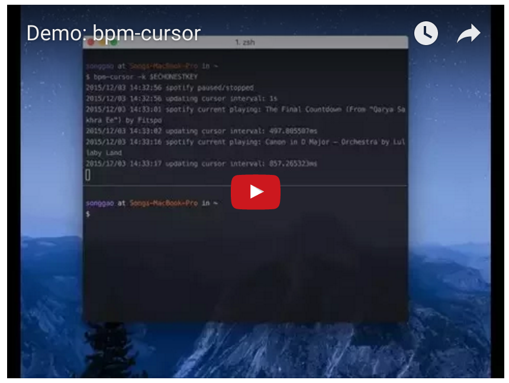

# bpm-cursor

Match terminal cursor flashing rate with BPM of the currently playing song.

Currently only works for Spotify + [iTerm Nightly](https://www.iterm2.com/version3.html).

Pull requests welcomed :D

## Demo

